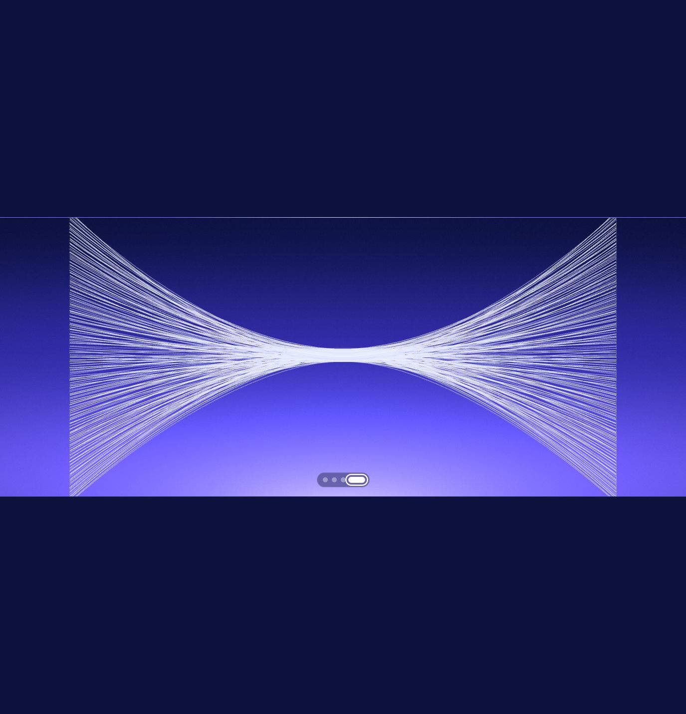

# WordPress Three.js Interactions

[Persian documentation](README.fa.md)

Two dependency-light, WordPress-ready interaction components built with semantic HTML, scoped CSS, vanilla JavaScript, and Three.js:

- **Interactive WebGL Bento Card** — pointer-following border light, subtle tilt/parallax, a reactive point field, and an accessible native dialog.
- **Four-State Vector Canvas** — a fiber-optic first state with continuous-width strands, luminous tips, breeze motion, and brush-like pointer response, plus three generated morph targets.



## Why this repository exists

This project is a clean-room interaction study. It reproduces general motion and interaction ideas observed on a public product page while using original markup, geometry, shaders, styling, copy, and implementation. It does not contain copied site source, private code, logos, screenshots from the reference site, or proprietary assets. It is not affiliated with or endorsed by Stripe.

## Quick start

The demos use native JavaScript modules, so serve the repository over HTTP:

```bash
python -m http.server 4173
```

Then open:

- `http://localhost:4173/` — project index
- `http://localhost:4173/bento-card/` — Bento card demo
- `http://localhost:4173/vector-canvas/` — vector canvas demo

No build step or package installation is required. The demos load Three.js `0.178.0` from jsDelivr, so an internet connection is required unless you self-host that module.

## Repository layout

```text
.
├── bento-card/
│   ├── index.html                 standalone demo
│   ├── component.html             reusable WordPress markup
│   ├── styles.css                 scoped component/demo styles
│   ├── bento-card.js              interaction and Three.js scene
│   ├── wordpress-functions.php    enqueue example for WP 6.5+
│   └── previews/
├── vector-canvas/
│   ├── index.html                 standalone canvas demo
│   ├── component.html             reusable WordPress markup
│   ├── styles.css                 scoped component/demo styles
│   ├── stats-section.js           geometry, shaders and morphing
│   ├── wordpress-functions.php    enqueue example for WP 6.5+
│   └── previews/
└── docs/
    ├── architecture.md
    ├── customization.md
    └── wordpress-integration.md
```

## WordPress integration

Each component is independent. Copy only the folder you need into your child theme, enqueue its CSS and JavaScript module once, then place `component.html` in a Custom HTML block or theme template.

The included PHP snippets use `wp_enqueue_script_module()`, available in WordPress 6.5+. Older versions can use a literal `<script type="module">` tag. See [the complete WordPress guide](docs/wordpress-integration.md).

## Public APIs

Initialize Bento cards added after page load:

```js
window.WMInteractiveBento.init(document);
```

Switch the vector topology from existing controls:

```js
window.WMVectorCanvas.setState('[data-wm-vector]', 0); // fiber-optic spray
window.WMVectorCanvas.setState('[data-wm-vector]', 1); // hemisphere routes
window.WMVectorCanvas.setState('[data-wm-vector]', 2); // wave ribbons
window.WMVectorCanvas.setState('[data-wm-vector]', 3); // hourglass curves
```

Or target one instance with an event:

```js
document.querySelector('[data-wm-vector]').dispatchEvent(
  new CustomEvent('wm:vector-state', { detail: { state: 2 } })
);
```

## Runtime behaviour

- Rendering pauses when a component leaves the viewport or the tab is hidden.
- Device pixel ratio is capped to control GPU load.
- `ResizeObserver` keeps the canvas matched to the component.
- `prefers-reduced-motion` disables continuous motion.
- The Bento card retains a CSS visual fallback when WebGL or the CDN fails.
- The first state's pointer deformation bends connected ribbon geometry around a soft exclusion area; it is not a video or sprite animation.

Read [architecture](docs/architecture.md) for the implementation model and [customization](docs/customization.md) for palettes, timing, geometry, and control wiring.

## Browser support

Current evergreen Chrome, Edge, Firefox, and Safari with WebGL and ES module support. Test on the actual devices used by your audience, especially low-power mobile hardware and embedded WordPress webviews.

## License

Project code and documentation are available under the [MIT License](LICENSE). Three.js is an external MIT-licensed dependency and is not vendored in this repository.
